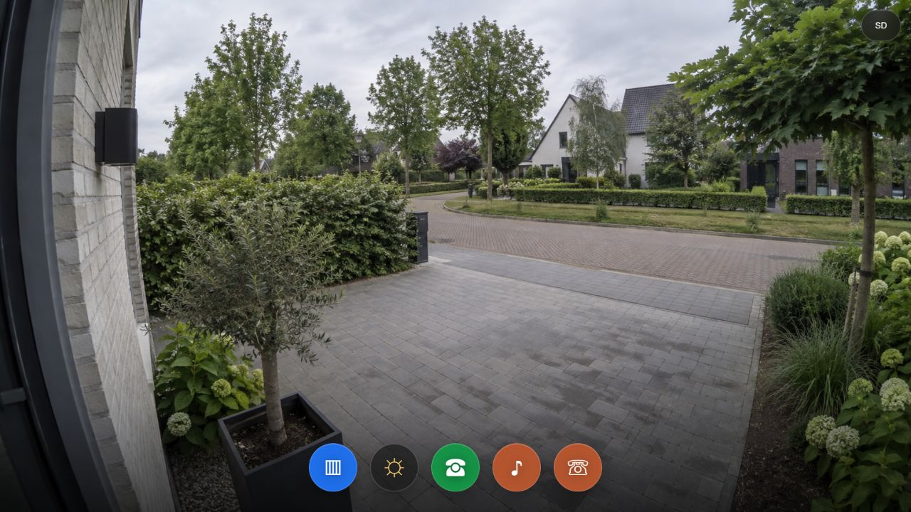

# Intercom Camera Card

[](https://my.home-assistant.io/redirect/hacs_repository/?owner=alphasixtyfive&repository=intercom-camera-card&category=plugin)

A Home Assistant dashboard card for an intercom camera. It puts live video, a Talk button, and your gate, light, sound, or announcement controls in one place.



The camera scene in this screenshot is generated. The buttons match the front gate example below.

## What you need

Install [WebRTC Camera](https://github.com/AlexxIT/WebRTC) and set up your stream in go2rtc. This card uses WebRTC Camera's `/webrtc/video-rtc.js` and `/api/webrtc/ws` endpoints; Home Assistant's built-in go2rtc integration does not provide them.

For Talk, your camera and go2rtc stream must support two-way audio. Open Home Assistant through HTTPS or localhost so the browser can use your microphone.

## Install

### HACS

1. Open HACS and add `https://github.com/alphasixtyfive/intercom-camera-card` as a custom **Dashboard** repository.
2. Install **Intercom Camera Card** and refresh Home Assistant.

HACS normally adds the dashboard resource. If it does not, add this resource under **Settings → Dashboards → Resources**:

```yaml
url: /hacsfiles/intercom-camera-card/intercom-camera-card.js
type: module
```

### Manual

Download `intercom-camera-card.js` from the [latest release](https://github.com/alphasixtyfive/intercom-camera-card/releases/latest), copy it to `/config/www/`, and add:

```yaml
url: /local/intercom-camera-card.js
type: module
```

## Add a card

Use a go2rtc stream name:

```yaml
type: custom:intercom-camera-card
stream: front_gate
```

Or use a Home Assistant camera entity:

```yaml
type: custom:intercom-camera-card
entity: camera.front_gate
```

Here is the front gate layout shown above:

```yaml
type: custom:intercom-camera-card
stream: front_gate
alternate_stream: front_gate_low
primary_label: HD
alternate_label: SD
player: media_player.front_gate
buttons:
  - title: ED-209
    icon: mdi:robot
    sound: ed-209-20-second-to-comply.mp3
  - title: Warning
    icon: mdi:shield-alert
    appearance: warning
    tts: Warning. This area is monitored.
  - entity: cover.front_gate
    title: Gate
    position: right
  - entity: light.driveway
    title: Driveway
    position: right
```

Replace the stream and entity names with your own. The middle Talk button appears by default; set `talk: false` to hide it.

## Options

| Option | What it does |
| --- | --- |
| `stream` | go2rtc stream name or URL. |
| `entity` | Home Assistant camera entity for the primary stream. Takes priority over `stream` when both are set. |
| `url` | Direct camera source URL if you are not using `stream`. |
| `alternate_stream` | Second stream, with a switch in the upper-right corner. |
| `primary_label`, `alternate_label` | Names on the stream switch. Defaults: `Main` and `Alt`. |
| `buttons` | Controls beside the Talk button. |
| `player` | Default `media_player` for sound and TTS buttons; a single entity or a list. |
| `tts_entity` | TTS provider. Defaults to `tts.home_assistant_cloud`. |
| `talk` | Set to `false` to hide Talk, or use an object to change its labels and icons. |
| `server` | go2rtc server URL if your WebRTC Camera setup uses an external server. |
| `mobile_pan` | Set to `false` to turn off horizontal video panning on small screens. |

Set at least one of `stream`, `entity`, or `url`. Basic settings are available in the visual card editor; buttons and state overrides use YAML.

## Buttons

Buttons appear left of Talk unless you set `position: right`. An entity button uses its Home Assistant state:

- A `light` toggles on and off.
- A `cover` opens when closed and closes when open.
- Other entities open their more-info dialog.

Unavailable lights and covers are disabled. You can also set `hidden: true` or `disabled: true` on a button.

A sound button plays a file through `player`. Relative file names are read from `/local/sounds/`:

```yaml
player: media_player.front_gate
buttons:
  - sound: warning.wav
    title: Warning
```

A TTS button speaks a message through the same player:

```yaml
buttons:
  - tts: Please leave the package at the door.
    title: Parcel
    position: right
```

You can set `player` or `tts_entity` on an individual button. For other actions, use Home Assistant's usual `tap_action` format:

```yaml
buttons:
  - title: Unlock
    icon: mdi:lock-open-variant
    tap_action:
      action: perform-action
      perform_action: lock.unlock
      target:
        entity_id: lock.front_door
```

Buttons can also have `states` overrides for their title, icon, colors, action, visibility, and disabled state. See [Home Assistant's dashboard actions](https://www.home-assistant.io/dashboards/actions/) for action syntax.

## Talk and video

Press Talk to connect your browser microphone; press it again to hang up. Sound and TTS buttons are disabled during Talk so they do not compete for the intercom speaker. If microphone access fails, the card shows a short message. Check browser permission, HTTPS, and your camera's go2rtc talkback setup.

While video connects, the message stays in the center. If you return to the same camera in the current tab, the card can show a blurred, dimmed copy of its last frame for up to two minutes. A first visit or page reload starts with a plain background. Brief connection drops can recover; repeated failures use a longer retry delay.

On a small screen, drag the video horizontally to adjust the crop. The card remembers the position for each stream. Use `mobile_pan: false` to disable this.

## Troubleshooting

- **Card missing:** Check that the JavaScript resource is loaded as a module, then refresh your browser.
- **Video missing:** Check the stream in go2rtc and make sure WebRTC Camera provides `/webrtc/video-rtc.js`.
- **Talk missing:** Check HTTPS or localhost, microphone permission, and whether your go2rtc source supports talkback. A plain receive-only RTSP stream may show video without supporting Talk.
- **Buttons do nothing:** Check the entity IDs, player, and `tap_action` in your card YAML.

## Development

Install Node.js 22.13 or newer, then run:

```bash
npm ci
npm run check
npm run format:check
```

The readable source is in `src/`. Run `npm run build` after changing it; `intercom-camera-card.js` is the generated file used by HACS and manual installs. `npm run preview` opens a local demo with simulated entities and video.

## License

MIT
